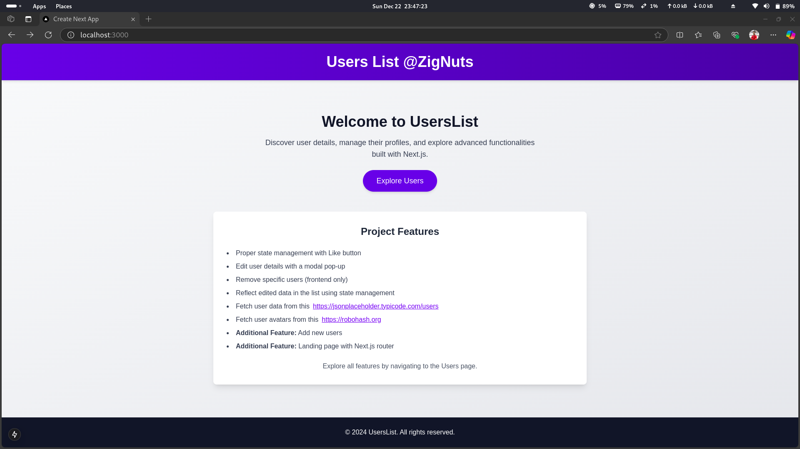
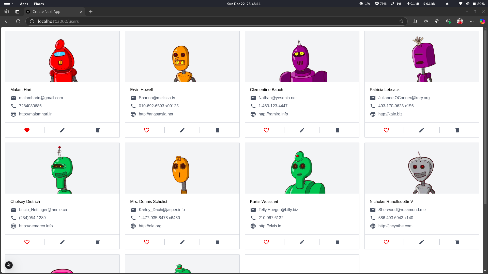

# Users Management Application

This application provides a user management system with the following features:

## Features

- Proper state management with Like button
- Edit user details with a modal pop-up
- Remove specific users (frontend only)
- Reflect edited data in the list using state management
- Fetch user data from this [API](https://jsonplaceholder.typicode.com/users)
- Fetch user avatars from [RoboHash](https://robohash.org)
- **Additional Feature:** Add new users
- **Additional Feature:** Landing page with Next.js router

## Users List

The users list is fetched from the following API: [https://jsonplaceholder.typicode.com/users](https://jsonplaceholder.typicode.com/users). Each user has an avatar fetched from [RoboHash](https://robohash.org).

## How to Run

1. Clone the repository.
2. Install dependencies using `npm install`.
3. Run the application using `npm run dev`.
4. Open your browser and navigate to `http://localhost:3000`.

## Live Demo

Check out the live demo of the application [here](https://users-management-three.vercel.app/).

## Technologies Used

- React
- Next.js
- Tailwind CSS
- Axios

## Screenshot

## Contributing

Feel free to submit issues and pull requests for new features or bug fixes.

## License

This project is licensed under the MIT License.